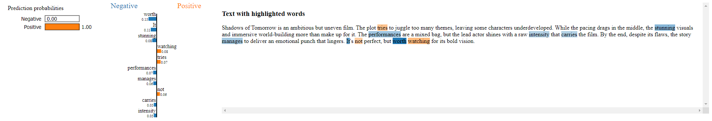

# LIME-Text-Model-Explainer

## Disclaimer
This repository contains code that was developed as part of an internship project. 
Please note that this version is not fully polished as it was developed with a focus on completing the internship within a limited time frame.

## About
This Python script is usefull to test and try to explain the predictions of different (Keras) sentiment analysis model using the LIME tool.

## Supported Features
| Feature  | Status |
| ------------- | ------------- |
| 🧠 Use your own model | ✅ |
| 🔍 Explain model result with LIME | ✅ |
| 🛠 Customize the output file name | ✅ |
| 🛠 Adjust the number of features to display with LIME | ✅ |
| ☕ Make a cup of coffee | ❌ |

## Screenshots
Below are some screenshots of the script output. These are generated in html.



## Requirements
- **Python 3.11+**

### Python Dependecies
The script depends on the following libraries:
- Tensorflow
- Keras
- LIME

You can install these dependencies via [PyPI](https://pypi.python.org/pypi/lime) by running:

```sh
pip install --upgrade pip
pip install keras tensorflow lime
```

## Running the script
Basic command line usage:
```sh
python result.py [--m model] [--t text]
```

- `--m` or `--model`: Specifies the path to the model file (required).
- `--t` or `--text`: The input text (required).
- `--f` or `--feat`: Number of features to display with LIME (optional, default: 10).
- `--o` or `--output`: Name of the output file (optional, default: "output.html").

This information is also available through the command line options
```sh
python result.py --h
```

## Example Usage
Here’s an example of how to run the script:
```sh
python result.py --m my_model.keras --t "This movie was fantastic!" --f 3 --o result.html
```

This command will:
1. Use `my_model.keras` for prediction.
2. Explain the prediction for the provided text.
3. Limit the LIME output to 3 features.
4. Save the result to `result.html`.

## How it Works
The script utilizes the **LIME** framework to explain the model's predictions:
1. It takes a pre-trained model (e.g., Keras) and a text input (a movie review).
2. LIME generates explanations by perturbing the input text and observing how the model’s predictions change.
3. The results are saved as an HTML file for easy visualization of the important features influencing the prediction.

## Credits
- LIME - https://github.com/marcotcr/lime for enabling model interpretability.
